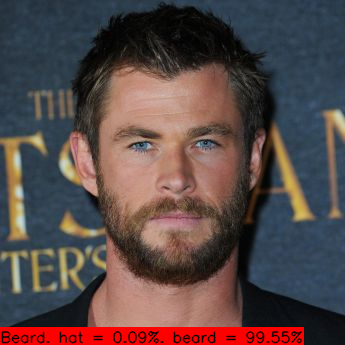
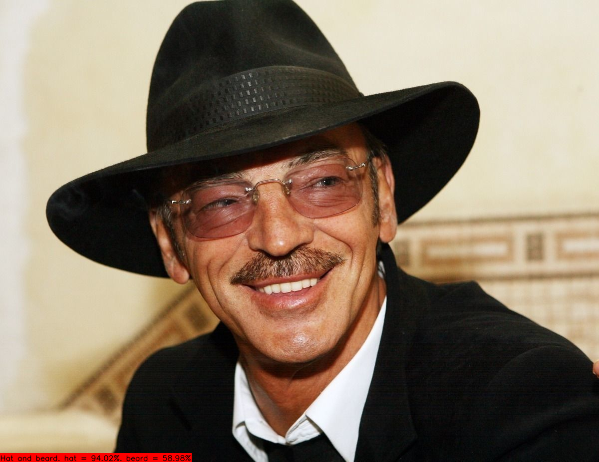
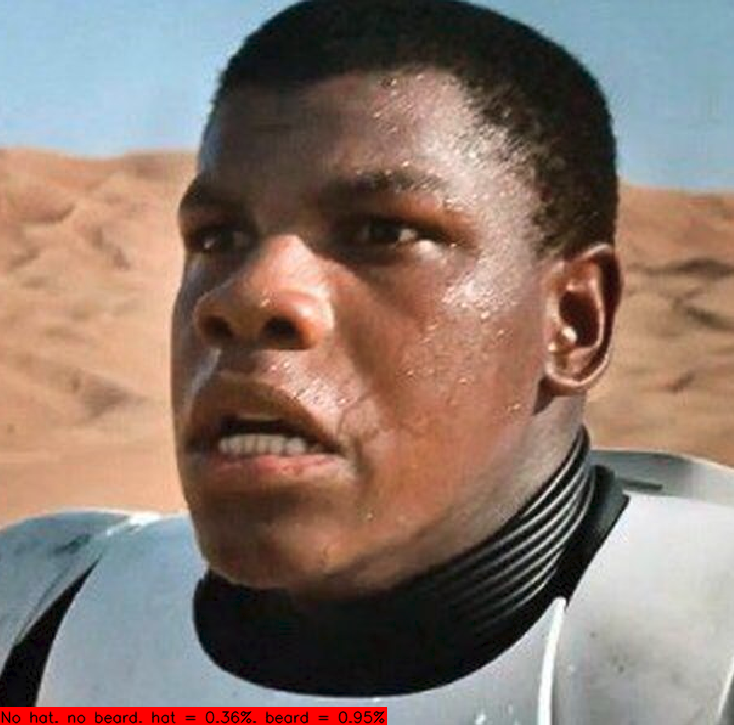

# Hat/beard classifier with OpenCV face detector

Script for hat/beard classifying using opencv face detector.

Images are classified into two categories.
1) **The presence of a headgear** (class `hat`): any headgear (hat, cap, etc.) is present or any headgear
   is completely absent.

2) **The presence of facial hair** (class `beard`): mustache, beard, noticeable stubble or any facial
   hair is completely absent.
   
There are `HatBeardClassifier` and `SimpleFaceDetector` classes provided.

See `main.py` as example of using these classes.

### 1. Video processing
Run this to detect all faces in webcam `0` and classify them:
```shell
python main.py -v 0
```
Or run this to process the video file:
```shell
python main.py -v path/to/video/file.avi
```
Webcam/video will be shown frame-by-frame with all found and classified faces. Press `q` to stop and exit.

### 2. Image processing
Run this to detect all faces in images in folder `image_folder` and classify them:
```shell
python main.py --images path/to/image_folder
```
Or run this to classify whole images without face detection:
```shell
python main.py --images path/to/image_folder --no_detector
```
Processed images will be shown frame-by-frame with all found and classified faces. Press any key to
continue to next image or press `q` to exit.

### 3. Prediction examples:



